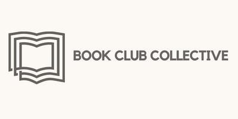

# Book-Club-Collective

[](https://opensource.org/licenses/MIT)



Welcome to Book Club Collective!

Books are a wonderful escape and can take you on deep personal journeys but we here at Book Club Collective believe they can be even more enjoyable when explored as a community! To support this passion we have created a site in which you can search the Google Books API to find all your favorite reads! Our page enables you to connect with others in the form of reviews and one day soon you will be able to enjoy Clubs which will act as a forum where you can deep-dive into discussions over your most beloved tomes. Once more welcome to Book Club Collective, we can't wait to hear from you!


## Table of Contents

1. [Description](#description)

1. [Wireframe](#wireframe)

1. [Screenshot](#screenshot)

1. [Installation](#installation)

1. [Usage](#usage)

1. [License](#license)

1. [Collaborators](#collaborators)

1. [Contact](#contact)

1. [Link to Deployed App](#sample)

## <a id="description"></a>Description

- Book Club Collective is a full stack application where users can create accounts search for books using Google's Book API as well leave reviews and join book clubs. Book Club Collective uses a folder structure that matches the MVC paradigm as well as Node.js and Express to create a RESTful API. Book Club Collective uses MySQL and Sequelize for the database and [npm star-rating.js](https://www.npmjs.com/package/star-rating.js) to create a star rating system out of 5 for the book reviews and then averages them out per book. 

## <a id="wireframe"></a>Wireframe

The basic wireframe structure we created at the beginning of this project.


## <a id="screenshot"></a>Screenshot


## <a id="installation"></a>Installation

- Run the following to install dependancies, the following will be installed, express, mysql2, bcrypt, dotenv, sequelize, connect-session-sequelize, express-session, express-handlebars

```
npm i
```

## <a id="usage"></a>Usage

- The repo can be forked and then the required modules installed as per above. The application can be run from the command line with the entry point "node server.js"

## <a id="license"></a>License

- MIT

## <a id="collaborators"></a>Collaborators

- Michael Feldman, Ehsan K, Hannah McDonald, Ben Slinde, Pia T

## <a id="contact"></a>Contact

- If you would like, you can connect with any of the creators through their github profiles

  [Michael Feldman](https://github.com/micah41224)

  [Eshan K.](https://github.com/ekhosr)

  [Hannah McDonald](https://github.com/hannahnmcdonald)

  [Ben Slinde](https://github.com/stevenslade)

  [Pia T](https://github.com/ptriv1)

## <a id="sample"></a>Link to Heroku Deployment

- [Experience Book Club Collective](https://intense-tor-64466.herokuapp.com/)
