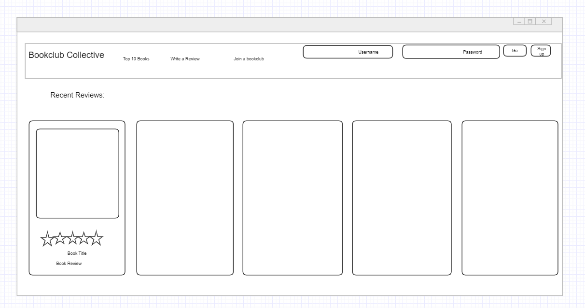

# Book-Club-Collective

A Full stack app for reviewing books and finding a book club of like minded readers

## Table of Contents

1. [Description](#description)

1. [Screenshot](#screenshot)

1. [Installation](#installation)

1. [Usage](#usage)

1. [Collaborators](#collaborators)

1. [Contact](#contact)

1. [Link to Deployed App](#sample)

## Description

* This application allows you as a book reader to find reviews of books submitted by other readers, submit your own reviews for other readers to enjoy and to find a book club with whom you can enjoy discussing your reads.

## Wireframe

## Screenshot

## Installation

* Run the following to install dependancies, the following will be installed, express, mysql2, bcrypt, dotenv, sequelize, connect-session-sequelize, express-session, express-handlebars

> npm i

## Usage

* The repo can be forked and then the required modules installed as per above.  The application can be run from the command line with the entry point "node server.js"

## Collaborators

* Michael Feldman, Ehsan K, Hannah McDonald, Ben Slinde, Pia T

## Contact

* If you would like, you can connect with any of the creators through their github profiles

    [Michael Feldman](https://github.com/micah41224)

    [Eshan K.](https://github.com/ekhosr)

    [Hannah McDonald](https://github.com/hannahnmcdonald)

    [Ben Slinde](https://github.com/stevenslade)

    [Pia T](https://github.com/ptriv1)

## Link to Heroku Deployment

* [Experience Book Club Collective](THIS WILL BE A LINK TO HEROKU)
